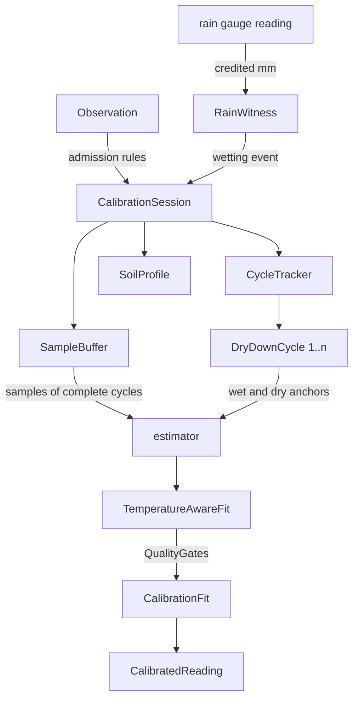

# Domain model

> Language: English. Scope: the objects the calibration is made of, the rules
> they enforce, and the boundary between them and Home Assistant.

This document is the contract of `custom_components/neverdry_calibrator/model/`.
It exists because the interesting part of this integration is not the arithmetic,
it is the judgement: deciding when a cheap probe may be believed. That judgement
is made of a handful of objects with invariants, and an invariant that lives only
in someone's head is an invariant that will be broken by the next change.

The rule that governs the whole package: **the domain imports nothing from Home
Assistant**. A test asserts it (`tests/test_architecture.py`), and a CI job runs
the domain suite with pytest and the standard library alone. The consequence is
that everything below can be reasoned about, and reproduced, without a running
instance.

## 1. Glossary

The vocabulary is taken from soil physics, and is used with exactly that meaning.
Mixing it with everyday language ("wet", "dry", "moisture level") is what produces
code where two numbers on different scales end up compared.

| Term | Symbol | Unit | Meaning |
|---|---|---|---|
| Raw probe index | `R` | percent points, 0 to 100 | What the cheap probe publishes. Monotone in soil water, otherwise arbitrary. |
| Volumetric water content | `theta` | m3/m3 | Volume of water per volume of soil. What "soil moisture" means when it means anything. |
| Field capacity | `theta_fc` | m3/m3 | Water the soil retains after free drainage. |
| Wilting point | `theta_wp` | m3/m3 | Water the plant can no longer extract. |
| Saturation | `theta_sat` | m3/m3 | Porosity. Upper clamp of the published value. |
| Root depth | `Zr` | m | Depth of the root zone the deficit is defined over. |
| Total available water | `TAW` | mm | `(theta_fc - theta_wp) * Zr * 1000`. The reservoir. |
| Water deficit | `D` | mm | Millimetres missing from field capacity, computed by another integration. |
| Available water fraction | `AW` | 0 to 1 | `1 - D / TAW`, clamped. |
| Wet anchor | | | First settled reading after irrigation and drainage: field capacity by definition. |
| Dry anchor | | | Reading at the deepest deficit reached in a cycle. |
| Dry-down cycle | | | One irrigation, followed by the drying that precedes the next. The unit of evidence. |

## 2. The map the model implements

Two quantities, one reservoir, one conversion, in one place:

```
theta = theta_fc - D / (1000 * Zr)          (soil.py, moisture_at_deficit)
D     = (theta_fc - theta) * 1000 * Zr      (soil.py, deficit_at_moisture)
AW    = 1 - D / TAW                          (soil.py, available_fraction)
```

The calibration itself is the map from the probe to the first of these:

```
theta_hat = a * R + b + c * (T - T_ref)     (calibration.py, CalibrationFit.estimate)
```

`a` and `b` come from a robust regression over admitted samples, `c` is an
optional thermal term that is kept only when it reduces the residual.

## 3. Objects

### 3.1 Value objects

Immutable, no identity, compared by value.

| Object | Module | Holds | Enforces |
|---|---|---|---|
| `SoilProfile` | `soil.py` | texture, `theta_fc`, `theta_wp`, `Zr`, `theta_sat` | `0 < theta_wp < theta_fc <= theta_sat < 1`, `Zr > 0`. Refuses construction otherwise. Sole owner of the deficit/moisture conversion. |
| `Observation` | `samples.py` | one reading of every source plus the age of each | Nothing. It is the boundary type: whatever Home Assistant had at that instant. |
| `AdmissionPolicy` | `samples.py` | freshness, rate, drainage and frost thresholds | The admission contract, in one readable place. |
| `Sample` | `samples.py` | `R`, `D`, `theta_ref`, temperatures, cycle index, soil fingerprint | That its `theta_ref` was derived through the reservoir named by its fingerprint. |
| `CyclePolicy` | `cycles.py` | irrigation, anchor and span thresholds as fractions of TAW | That thresholds scale with the reservoir instead of being absolute millimetres. |
| `RainPolicy` | `rain.py` | wetting depth as a fraction of TAW, and the silence that ends an event | Same scaling rule, for the same reason. Defaults to the irrigation drop fraction, so rain counts exactly when the same depth of irrigation would. |
| `RainUpdate` | `rain.py` | millimetres credited, event depth, whether it is raining, when a wetting ended | That a wetting is reported once, at the instant of the last drop rather than of the poll that noticed. |
| `QualityGates` | `calibration.py` | minimum cycles, samples, span, R squared, residual | What "earned" means. |
| `PlacementPolicy` | `placement.py` | the six placement thresholds | What "worth reading" means. Advisory by construction: nothing consults it before publishing. |
| `PlacementVerdict` | `placement.py` | confidence, every suspicion, the numbers behind them | That a suspicion is never published without the figure that raised it. |
| `LineFit`, `TemperatureAwareFit` | `estimator.py` | slope, intercept, diagnostics, thermal term | Nothing beyond arithmetic. |
| `CalibrationFit` | `calibration.py` | the published line, its provenance, its range and quality | That a line carries the range it was tested over and the reservoir it was fitted against. |
| `CalibratedReading` | `calibration.py` | moisture, available fraction, implied deficit, flags | The output shape consumers read. |

### 3.2 Entities

Have identity and change over time.

| Entity | Identity | Lifecycle |
|---|---|---|
| `DryDownCycle` | `index`, assigned in order | Opens on a wet anchor, absorbs samples, closes on the next irrigation. Once closed it never reopens. |
| `CycleTracker` | one per session | Three-state machine over the irrigate/drain/dry loop. Records which water is pending, and stamps it on the cycle that opens next. |
| `RainWitness` | one per probe | Turns gauge readings into credited millimetres and wetting events. One per probe rather than per site: the threshold is a share of *this* probe's reservoir. Holds no clock; every instant is passed in. |

### 3.3 Aggregate root

`CalibrationSession` owns the buffer, the tracker, the policies, the gates and
the fit. Everything outside the package talks to it and to nothing else, which is
what makes the invariants below enforceable rather than hoped for.



## 4. Invariants

These are the statements that must hold after every operation. Each one is
covered by at least one test, named in the right-hand column.

| # | Invariant | Why it exists | Test |
|---|---|---|---|
| I1 | Every sample in the buffer was derived through the *current* soil profile. | Comparing a deficit against a moisture defined on another reservoir is the original sin of this domain. | `test_changing_the_soil_keeps_the_measurements_and_drops_the_fit` |
| I2 | Only samples belonging to complete cycles reach the estimator. | A cycle that is still open can still be spoiled by what happens next. | `test_an_open_cycle_is_never_counted` |
| I3 | A fit is published only if every gate passed and the slope is positive. | A negative slope is a wiring or siting fault; inverting it silently hides it. | `test_a_probe_wired_backwards_is_refused_rather_than_inverted` |
| I4 | While no fit is published, `calibrated_reading` returns `None`. | An uncalibrated probe has nothing to say, and a plausible number is worse than no number. | `test_nothing_is_published_before_the_cycles_are_earned` |
| I5 | A reading outside the fitted range is published with the extrapolation flag set. | The line was never tested there. | `test_a_reading_outside_the_fitted_range_is_flagged_as_extrapolated` |
| I6 | A device-side calibration change or a source change clears samples and cycles; a soil change keeps them and re-derives them. | The first changes the instrument, the second only its interpretation. | `test_a_device_side_calibration_change_drops_the_samples_too` |
| I7 | `status` is derived from the fit, the verdict and the drift; it is never assigned from outside the aggregate. | Otherwise the published status and the published value can disagree. | `test_drift_is_measured_against_the_published_line` |
| I8 | A stored fit whose soil fingerprint differs from the configured soil is not restored. | A restart must not resurrect a statement about a reservoir that no longer exists. | `test_a_stored_fit_from_another_soil_is_not_restored` |
| I9 | An unreadable store costs history, never the integration. | Weeks of samples are valuable; an instance that will not start is worse. | `test_an_unreadable_store_costs_history_not_the_integration` |
| I10 | Every rejected observation carries a named reason, and reasons are counted. | A probe that never calibrates must be able to say why. | `test_each_failure_mode_has_its_own_named_reason` |
| I11 | A gauge reading is credited only as a positive increment, and the first reading after a restart is never credited. | A counter that falls is a reset, and a restored state is water already counted. Both would otherwise invent rain. | `test_a_counter_that_falls_is_a_reset_and_not_negative_rain`, `test_the_first_reading_after_a_restart_credits_nothing` |
| I12 | A cycle's water source is set when the cycle opens and never inferred afterwards; cycles stored before the gauge existed stay `UNKNOWN`. | The rain comparison is worth only as much as the certainty that the two groups are what they claim. | `test_a_cycle_stored_before_the_gauge_existed_stays_unknown` |

## 5. State machines

### 5.1 Cycle tracker

```
WAITING_FOR_WATER --(sample with D <= wet anchor threshold)--> DRYING
DRYING            --(water observed)------------------------> DRAINING
DRAINING          --(sample with D <= wet anchor threshold)--> DRYING
any               --(soil changed or manual reset)----------> WAITING_FOR_WATER
```

"Water observed" is any of three witnesses: the irrigation entity switching on,
a rain event reaching the wetting depth and then going quiet, or the deficit
collapsing by more than the irrigation drop fraction. Each names the water it
saw, and while draining an unnamed witness never overwrites a named one; two
different names make the pending water `MIXED`, which is evidence for the
calibration and deliberately no evidence for the wetted-bulb comparison.

Samples arriving in `WAITING_FOR_WATER` or `DRAINING` are not filed under any
cycle and are discarded from the fit. This is deliberate: before the first
observed wet anchor there is no way to place a reading on the moisture axis.

### 5.2 Calibration status

```
COLLECTING --(gates pass)--------------------> CALIBRATED
CALIBRATED --(recent residual > threshold)---> DRIFTING
DRIFTING   --(residual back under)-----------> CALIBRATED
any        --(probe sentinel stale)----------> PROBE_OFFLINE
any        --(soil, source or device change)-> INVALIDATED
INVALIDATED --(gates pass again)-------------> CALIBRATED
```

## 6. The Home Assistant boundary

The integration is a hub: one config entry holds a list of probes (`probe.py`),
and each probe gets its own coordinator, its own device and its own sample store.
Nothing in `model/` knows that several probes exist, which is why the hub shape
was a change to four files and to none of the domain.

| Responsibility | Side | Reason |
|---|---|---|
| Holding the probe list, one device per probe | Home Assistant (`probe.py`, `entity.py`) | Configuration and presentation, not physics. |
| Reading states, converting units, computing ages | Home Assistant (`coordinator.py`) | Only the host knows what a state is. |
| Reading the rain gauge, and knowing which shape it has | Home Assistant (`coordinator.py`, `settings.py`) | Which entity, which unit, and the identity of a reading are all host facts. How many millimetres make a wetting is domain. |
| Deciding that water reached the soil | Home Assistant | Three witnesses exist, a valve entity, a rain gauge and the deficit itself, and all three are host concerns. The *thresholds* are domain. |
| Deciding whether an observation is usable | Domain | It is a statement about the physics, not about entities. |
| Deciding what counts as a cycle | Domain | Same. |
| Fitting and gating | Domain | Same. |
| Persisting | Home Assistant, via `session.to_dict()` | The domain defines the payload, the host owns the file. |
| Publishing entities | Home Assistant | Presentation. |

## 7. Extension points

Three changes the model was shaped to accept without a rewrite:

* **Another estimator.** `fit_with_temperature` is a function returning a
  `TemperatureAwareFit`. A monotone piecewise or logistic form would replace that
  function, and the gates would judge it by the same diagnostics.
* **Another reference.** Anything that can produce a water content per timestamp
  can replace the deficit path, by building `Sample` objects directly. The
  reservoir stays the only converter.
* **Per-cycle weighting.** Cycles already carry their own spans and anchors, so
  weighting recent cycles more heavily is a change inside `_fit_samples`.
